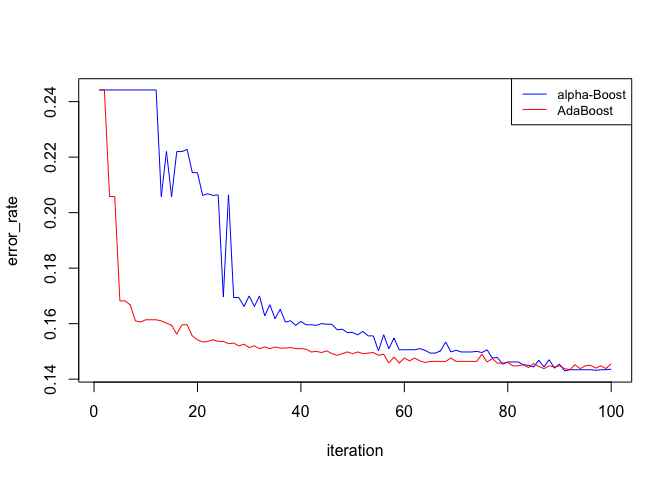

A Game Theory Approach of Boosting
================

-----

## Introduction

Although based on a very simple idea, Boosting is remarkably powerful to
solve supervised learning tasks like classification, and is moreover
easy to implement and tune as it only requires one single parameter to
be set. Belonging to the ensemble-learning paradigm, the underlying
principle is as follows: multiple “weak-classifiers”, that is models
doing slightly better than random guessing, are trained on distorted
versions of the training set, and these weak-classifiers are then
combined into a committee that uses voting to classify new features.
Now, this core principle can lead to a multitude of different boosting
algorithms, and this post aims to explain how game theory can lead to
the specific alpha-Boost algorithm. We then propose an implementation of
the alpha-Boost algorithm and compare its performance to the famous
AdaBoost algorithm.

## Boosting from a Game Theory Perspective

### Motivation

The main question Boosting tries to solve is how to find and combine
“weak-classifiers” having different knowledge from the training set in
order to form a final “strong classifier”? Those questions cannot be
answered by the classical process of minimizing some loss function, and
we therefore need to find another approach to come along. This is where
game theory comes in by providing the notion of player. Indeed, we can
break down the problem into two tasks: on the one hand classifiers have
to be found, and on the other hand, different aspects of the data must
be highlighted in order to acquire “different knowledge” of it. Those
tasks can easily be framed into players and a “game” will then
orchestrate their actions and interactions to make them look for the
solution we want.

### The Players

Now that we roughly described how game theory can help to solve our
problem, let us design more carefully the players. Each player must be
given a set of moves, so that one of them can be chosen at each round.
For the player responsible of providing classifiers, its moves will
simply be a set of trained models. However, how can we design a second
player that would highlight different aspects of the training data-set?
Bootstrapping is the key here, and we only need to twist its sampling
distribution to achieve this. Indeed, it usually uses an uniform
distribution to resample a data set, but by using other distributions,
it then becomes possible to stress particular regions and put the focus
on some particular data points. We thus have a player that will output a
classifier at each round, and another that will output a bootstrap
sample. The remaining question is how to put this mechanics into action
in order to extract the “strong classifier” we need?

### The Game

The game is the ingredient that will enable the players to move by
setting their goals and distributing the payoffs. To set the goals, we
have to come back to the boosting philosophy: classifiers having
different knowledge of the data should be identified. Therefore, the
player responsible of providing a classifier will be rewarded if the
classifier has any knowledge about the given data, and the player
responsible of highlighting some aspects of the training set will be
rewarded if these aspects cannot be caught by the first player: this
would mean it found new knowledge to acquire. We see here that this
goals are conflicting: one player will try to emphasis the regions of
the data set that are the hardest to classify, and the other will still
try to find some classifiers that overcome the difficulty. This is the
description of a simultaneously playing, zero-sum non-cooperative game.
Moreover, if we choose stumps as classifiers, it is proven that this
infinite set can be reduced to a finite number of stumps as its
Vapnik-Chervonenkis dimension is finite. Therefore, the game can also be
considered to be finite, and we then have at our disposal a rich theory
to understand it.

### The Solution

We just derived a game framework expressing the spirit of boosting, and
our hope is that it will be able to provide us with the desired
classifiers. To do so, we have to “solve” the game, that is to find its
Nash equilibrium. At this equilibrium, no player has any interest to
change its strategy to get more rewards, meaning that one player would
produce the mix of bootstrap samples that are the hardest to classify
and the other player would have found the classifiers allowing him to
have on average the smallest classification error possible under this
worst-case scenario. The idea is then to just extract the classifiers
found by the second player to build up the final classifier. The Nash
equilibrium can be hard to find, especially in our setup where the move
combinations are very high. Fortunately, we know from game theory that
the Nash equilibrium coincides with the minmax solution for zero-sum
game, and this solution can be approximated by the so called
“multiplicative-weight” algorithm for finite games. The following
explains how this works.

## Implementation

### Algorithm

The minmax solution is the strategy ensuring minimum loss for one player
given that its opponent will always choose the best strategy for him,
that is the one maximizing this same loss. The “multiplicative-weight”
algorithm tries to approximate this solution by iteratively updating one
player’s strategy given its performances against an omniscient opponent
who knows which strategy has been chosen before the game starts, and
therefore always chooses the best strategy to maximize the loss of the
first player. In our particular case, the loss for the player
responsible of producing the bootstrap sample is the opposite of the
classification error as explained above, and the algorithm then has the
following steps: the player responsible of choosing the bootstrap
samples will firstly announce its strategy. Given this strategy, the
other player will choose the strategy maximizing the loss of the first
player, that is minimizing the classification error. The game will then
be played, the loss of player one will be computed, and the latter will
then be allowed to update its strategy to try to do better. This update
will be done through the multiplicative-weight rule. As this process
progresses, it can be shown that the average of the strategies chosen by
the player picking the classifiers it the strong classifier we are
looking for. The following code shows that in action.

``` r
# PARAMETER ----
games_number <- 100 # number of games to be played
eta   <- 0.1 # setting the step size from one strategy to the other

# VARIABLES ----
n <- nrow(data)
P <- list() # container for the strategies of player 1
            #  - player 1 has to choose among the different possible 
            #    boostrap samples from the training set. 
            #  - it strategy is therefore the sampling distribution that should 
            #    be used for boostrapping the training set.
h <- list() # container for the strategies of player 2 
            #  - player 2 has to choose among the different possible classifiers. 
            #  - As player 2 plays second, he only chooses pure strategies: 
            #    given a boostrapping distribution, he knows (or can find by learning) 
            #    which classifier has the best performances.
            #  - Therefore, h directly contains the weak-classifiers (h for hypothesis)

error_rate <- c() # container for the error rates of the full classifier over
                  # the iterations. Not necessary for finding the minmax solution. 

# INITIAL STRATEGY ----
P[[1]] <- rep(1, n)/n # initial strategy of player 1: uniform

# MAIN ----
for(i in 1:games_number){
  # Step 1
  if(i > 1){
    # - player 1 is given a chance to look at the game results
    #   to update its strategy
    P[[i]] <- 
      P[[i-1]] * 
      sapply(player2.errors, 
            function(error){
              if(!error == 0){
                # wrong classified sample by player 2
                # -> its weight has to be increased
                # (will be increased through normalization)
                return(1)
              } else {
                # correctly classified sample by player 2
                # -> its weight has to be decrease
                return(exp(-eta))
                }
              }
            )
    P[[i]] <- P[[i]] / sum(P[[i]]) # normalization
  } 
  
  # Step 2 
  # - Time for player 2 to choose its strategy.
  #   Because player 2 knows player one strategy, he knows exactly which 
  #   classifier to choose. He therefore has a pur strategy consisting of 
  #   a full probability on one single classifier: 
  h[[i]] <- rpart(income  ~ .,
                  data    = data,
                  weights = P[[i]], 
                  method  = "class", 
                  control = rpart.control(minsplit =1,
                                          minbucket=1, 
                                          cp=0, 
                                          maxdepth = 1)) # one depth trees (stumps) are used here
  
  # Step 3
  # - the performances of player 2 is computed, and these 
  #   will be used by player 1 to update its strategy 
  player2.prediction <- as.numeric(predict(h[[i]], type = "class"))-1
  player2.errors <- abs(player2.prediction - data$income)
  
  
  
  # Optional
  # - We here keep track of the progress of the algorithm
  tmp <- matrix(as.numeric(unlist(lapply(h, predict, type = "class")))-1, nrow = n)
  tmp_2 <- round(rowSums(tmp)/i)
  error_rate[i] <- sum(abs(data$income-tmp_2))/n
}
```

### Analysis

Interestingly, the derivation of the boosting principles under the game
theory spotlight leads to an algorithm very similar to AdaBoost. The
main difference between those two algorithms is the way the
weak-classifiers are combined together: alpha-Boost will simply use an
absolute majority to classify new labels whereas AdaBoost will use a
weighted vote where classifiers performing better will be given a
stronger weight. The theory has already explored these two
implementations and it can be shown that they are both able to make the
training error as small as wanted under the weak-learnability
assumption, that is under the assumption that a weak-classifier can
always be found. However, AdaBoost is an improvement over alpha-Boost in
the sense that it will theoretically reduce the training error much
faster through its adaptive mechanism. Moreover, AdaBoost only requires
one single parameter to be set (the number of iterations) whereas
alpha-Boost needs two parameters.

### Testing

The boosting algorithms have been tested over a census income data set
made up of 5000 data points and 14 variables. The target variable was
the income class (over or under $50k) and the predictors where
sociodemographic information. The following plots show the performance
of the alpha-Boost and AdaBoost algorithms. As expected, we can see that
AdaBoost is able to reduce the training error much faster than the
alpha-Boost algorithm is. However, it seems that both algorithms cannot
reduce the training error under a certain lower bound (0.14). A
potential explanation is that the weak-learnability assumption is too
strong for the one-depth tree-space that has been used as
weak-classifier space. Therefore, after some iterations, no classifier
of this space might be able to do better than random guessing for the
provided bootstrap samples.

    ## [1] 0.1456

<!-- -->

## Conclusion & Go Further

Game theory is an interesting approach to analyse boosting as the core
idea of boosting can easily be translated into game theory concepts.
Surprisingly, this approach leads to an algorithm that is very similar
to the well known AdaBoost algorithm: alpha-Boost. The literature
already compared these two algorithms, and we provided here an
alpha-Boost implementation to illustrate the similarities, but also the
strengths of AdaBoost over alpha-Boost. To go further, one could try out
a different space of weak classifiers in order to overcome the potential
weak learnability violation. The class of two or three depth trees might
be sufficient. More generally, it could be interesting to see how
sensitive alpha-Boost is from eta in order to gain further insights
about this game theory generated algorithm.

## Acknowledgement

  - The data set was provided by the UCI machine learning repository:
    <https://archive.ics.uci.edu/ml/datasets/census+income>

  - For further information about the used AdaBoost implementation
    please refer to <https://xgboost.readthedocs.io/en/>

  - This article is mainly based on “Boosting, Foundation and Algorithm”
    written by Shapire and Freund:
    <https://mitpress.mit.edu/books/boosting>
