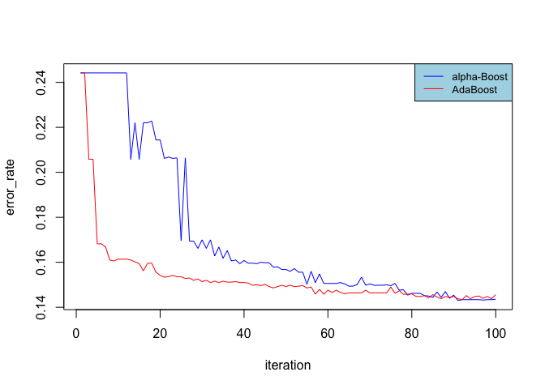

A Game Theory Approach of Boosting
================

-----

## Introduction

Although based on a very simple idea, Boosting is remarkably powerful to
solve supervised learning tasks, and is moreover easy to implement and
tune as it only takes one single parameter as input. Belonging to the
ensemble-learning paradigm, the underlying principle is as follows:
multiple weak-classifiers are trained on distorted versions of the
training set, and these weak-classifiers are then combined into a
committee that uses voting to classify new features. Now, this core
principle can lead to a multitude of different boosting algorithms, and
we propose in this post to explain how game theory can lead us to the
specific alpha-Boost algorithm. We then propose an implementation of the
alpha-Boost algorithm and compare its performance to the famous AdaBoost
algorithm.

## Boosting from a Game Theory Perspective

### Game Setup

Let us now rethink boosting under a game theory perspective and try to
derive an alternative algorithm from this analysis. The essence of
Boosting is to find and collect weak-learners that know something
different about the data, and to then combine their knowledge into a
final “strong classifier”. The question arising at this stage is how to
make the weak-classifiers always learn something new about the same
training set? The key to this problem is bootstrapping, and game theory
can help us to wrap this method in a framework to extract those needed
classifiers.

Indeed, bootstrapping allows us to resample the training set, and if we
twist it by modifying its sampling distribution (per default uniform),
we can emphasis spaces of the training set that are until now hard for
the weak-classifiers to label, and therefore force the latters to learn
something new. To put this mechanic into action, let us frame the two
main components of this methodology into players: the classifiers on the
one hand, and the bootstrapping on the other hand.

To sketch a more detailed picture of the game, we can imagine each round
having into action a first player responsible of choosing a bootstrap
sample from the source training set, and a second player due to select a
weak-classifier from a given class. The keystone of the game is then the
players’ rewards; at the end of each round, the classification error
computed with the outputted sample set and classifier will be taken as
the game score, and this score will form the first player’s reward and
the second player’s punishment.

To help us visualize this game, we can make an almost one to one
comparison to the well-known “rock, scissors, paper” game. Both games
need to be initialized with a distribution over the different player’s
possibilities, the so-called “strategies”. In “rock, scissors, paper”,
there are 3 possible moves for each players and a strategy could be to
always play rock, or to pick randomly a move according a uniform
probability. In the newly designed game, one player’s moves are the
bootstrap samples, and the other player’s moves are the classifiers.
Once the strategies are chosen, the two players select a move according
to their respective strategy simultaneously, payback are computed, and
the process can be rerun any amount of time.

This game can therefore be classified as a simultaneously playing,
zero-sum non-cooperative game. Moreover, if we choose stumps as
weak-learner, it is proven that this infinite set can be reduced to a
finite number of stumps as it Vapnik-Chevonenkis dimension is finite.
Therefore, the game is also finite.

### Game Solution

We just derived a framework expressing the spirit of boosting, and our
hope is that it will be able to find the desired classifiers. To do so,
we have to “solve” the game, that is to find its Nash equilibrium. At
this equilibrium, no player has any interest to change its strategy to
get more rewards, meaning that, by playing repeatedly, player one would
produce the mix of bootstrap samples that are the hardest to classify
and player two would have a strategy allowing him to have on average the
smallest classification error possible given player one’s strategy. We
would then just have to get the second player’s strategy to build up our
final classifier. Fortunately for us, the designed game is well known
from the game theory and its Nash equilibrium coincide with the minmax
solution. Moreover, the minmax solution can be solved through the so
called “multiplicative-weight” algorithm, and the following shows and
implementation of the solver.

## Implementation

### Algorithm

The Minmax solution in this particular setup it pretty straightforward
to find. Each game will be spited in two parts: the player responsible
for choosing the bootstrap sample will firstly announce its strategy.
Given player one’s strategy, the second player will then choose the
strategy maximizing its gain. The game will then be played, a feedback
will be given to player one, and the latter will then be allowed to
update its strategy in a way to try to decrease the gain that the second
player could achieve. This update will be done through the
multiplicative-weight rule. As this process gets along, the strategy of
player 1 will converge to the Nash equilibrium. However, what really
interests us is the Nash equilibrium strategy of player 2. It can be
shown that the average of the strategies chosen by player 2 during this
iterative process converge to this distribution. The following code
shows that in action.

``` r
# PARAMETER ----
rounds <- 100 # To be set
eta <- 0.1 # setting the step size from one strategy to the other

# VARIABLES ----
n <- nrow(data)
h <- list() # container for the weak-classifier (h for hypothesis)
P <- list() # container for the strategies of player 1 along the rounds
P_init <- rep(1, n)/n # initial strategie of player 1: uniform

loss <- c() # container for the error rates
labels <- data$income 

# MAIN ----
for(round in 1:rounds){
  # Step 1
  # - Player 1 chooses a strategy P to attempt increasing the second player's loss
  if(round > 1){
    P[[round]] <- P[[round-1]] * sapply(abs(result - data$income), 
                                        function(x){
                                          if(!x == 0){
                                            return(1)
                                          } else {
                                            return(exp(-eta))
                                            }
                                          }
                                        )
    P[[round]] <- P[[round]] / sum(P[[round]])
  } else {
    P[[round]] <- P_init
  }
  
  # Step 2 
  # - Time for player 2 to choose its strategy.
  #   Because player 2 knows player one strategy, he knows exactly which 
  #   classifier to choose. He therefore has a pur strategy consisting of 
  #   a one probability on the following classifier: 
  h[[round]] <- rpart(income  ~ .,
                      data    = data,
                      weights = P[[round]], 
                      method  = "class", 
                      control = rpart.control(minsplit =1,minbucket=1, cp=0, maxdepth = 1))
  
  # Step 3
  # - Rewards are computed and player 1 is given a chance to 
  #   look at these rewards to update its strategy. 
  result <- as.numeric(predict(h[[round]], type = "class"))-1
  
  # Optional
  # - We here keep track of the progress of the algorithm
  tmp <- matrix(as.numeric(unlist(lapply(h, predict, type = "class")))-1, nrow = n)
  tmp_2 <- round(rowSums(tmp)/round)
  loss[round] <- sum(abs(data$income-tmp_2))/n
}
```

### Analysis

Interestingly, the derivation of the boosting principles under the game
theory spotlight leads to an algorithm very similar to Adaboost. The
main difference between those two algorithms is the way the
weak-classifiers are combined together: alpha-boost will simply use an
absolute majority to classify new labels whereas Adaboost will us a
weighted vote where classifiers performing better will be given a
stronger weight. The theory has already explored these two
implementations and it can be shown that they are both able to make the
training error as small as wanted under the weak-learnability
assumption. However, Adaboost is an improvement of alpha-boost in the
sense that it will theoretically reduce the training error faster than
Alphaboost.

### Testing

The following plots show the performance of the alpha-Boost and Adaboost
algorithms. As expected, we can see that Adaboost is able to reduce the
training error much faster than the alpha-Boost algorithm is. However,
it seems that both algorithms cannot reduce the training error under a
certain lower bound (0.13). A potential explanation is that the
weak-learnability assumption is too strong for the one-depth tree-space.
Therefore, after some iterations, no classifier of this space might be
able to do better than random guessing for the provided bootstrapped
sample.

    ## [1] 0.1456

<!-- -->

## Go Further

In order to go further, one could try out a different space of weak
classifier in order to overcome the potential weak learnability
violation. It would also be possible to performe a sensitivity analysis
of the alpha-Boost algorithm with respect to the eta parameter, in order
to better select it.

### Acknowledgement

The data set was provided by
<https://archive.ics.uci.edu/ml/datasets/census+income> For further
informartion about the used boosting implementation please refere to
<https://xgboost.readthedocs.io/en/> This article is mainly based on
“Boosting, Foundation and Algorithm” written by Shapire and Freund.
