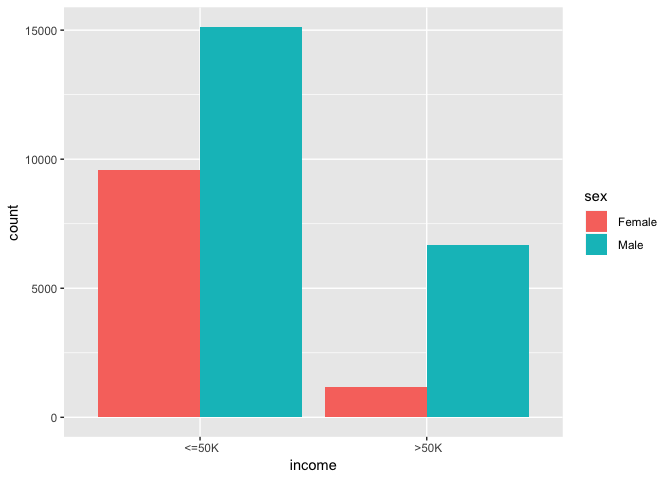
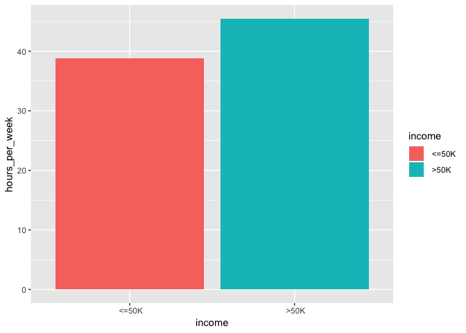
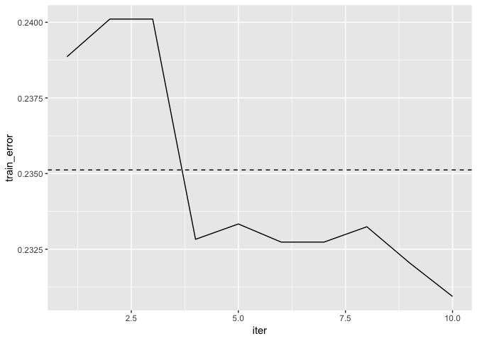

Boosting Insights
================

-----

## Introduction

The following will test boosting capabilities to predict incomes given
some sociodemographic variables. We will then challenge boosting with
other closely related Machine Learning methods.

## Exploratory Data Analyis

First of all, let us generate some visualization of the dataset to get
some intuition about the data and its potential relationships.

### Histograms

The following histogram shows that the majority of people in the dataset
belong to the “under 50k” category, that the dataset is biased toward
male samples and that the proportion of the “over 50k” category compared
to the “under 50k” category is higher for males than for females.

    ## Warning: Ignoring unknown parameters: binwidth, bins, pad

<!-- -->

We can see next that the dataset indicates a potential relationship
between the hours worked per week and the income category. Indeed,
People belonging to the “over 50k” income category work on average
approximately 7 hours more than people belonging to the “under 50k”
category.

<!-- -->

## Boosting

Now that we have a better feeling about the data, let us run our first
model on it.

### Short Review

Boosting classifies values based on a weighted vote:
=sign(\\sum_{t=1}^T\\alpha_th_t(x))")

### Code In Action

Let us now run a boosting algorithm on the data.

The following shows how the training error decreases over the iteration,
an compares it to the generalized error (dashed line)
<!-- -->

### Performances

### Acknowledgement

The dataset was provided by
<https://archive.ics.uci.edu/ml/datasets/census+income> For further
informartion about the used boosting implementation please refere to
<https://xgboost.readthedocs.io/en/>
