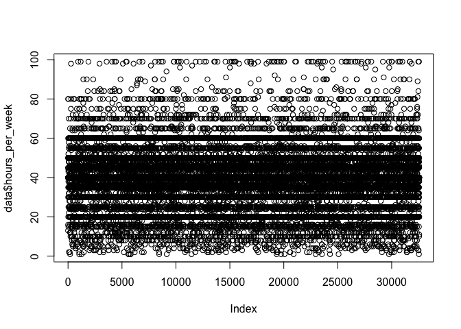

Boosting Insights
================

Introduction
------------

The following will test boosting capabilities to predict incomes given
some sociodemographic variables. We will then compare boosting to other
Machine Learning methods and try to understand the differences.

Exploratory Data Analyis
------------------------

First of all, let us deep-dive in the dataset.

Boosting Review
---------------

Boosting classifies values based on a weighted vote:
=sign(\sum_{t=1}^T\alpha_th_t(x))")
